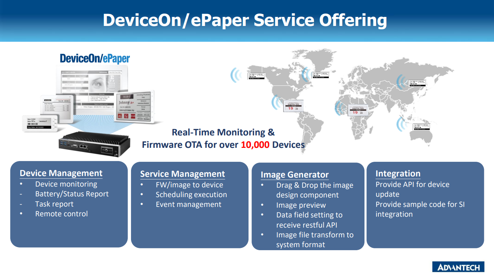
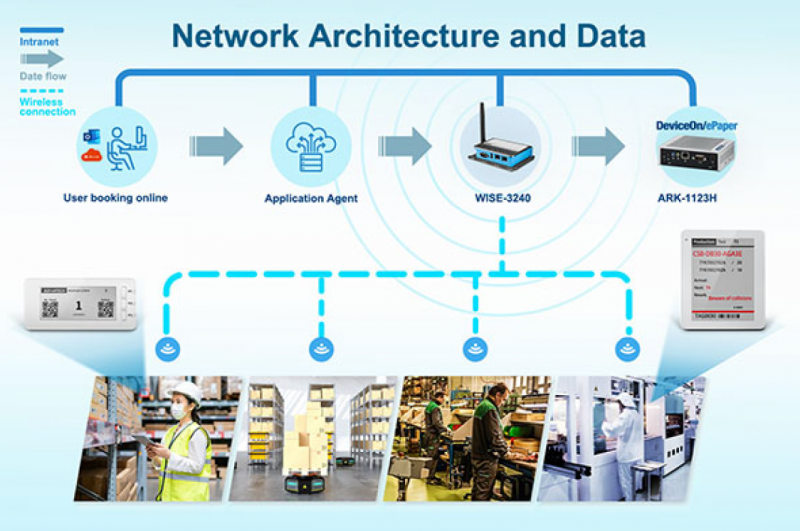

# 💡 About DeviceOn/ePaper

DeviceOn/ePaper is a software platform developed by Advantech, a global leader in industrial computing solutions. It is [designed](http://ess-wiki.advantech.com.tw/wiki/images/4/4c/EPD\_SoftwareStack\_v2.0.png) to manage ePaper displays, which are electronic paper displays that can be updated remotely and display information. EPD Device optimizes power consumption through two-way communication and realizes device roaming, reliable communication [security](http://ess-wiki.advantech.com.tw/view/DeviceOn/ePaper\_Security), and information display.

<figure><figcaption></figcaption></figure>

A surge in market demand for Industrial IoT products has rapidly increased the number of connected devices that are currently deployed and managed across different locations. It is essential to effectively manage, monitor, and control thousands of connected EPD devices while ensuring uninterrupted service. EPD Devices must work properly and securely after they have been deployed - without requiring frequent visits from service technicians. Customers require secure access to their devices to detect, troubleshoot, and undertake time-critical actions.

<figure><figcaption></figcaption></figure>

## Video Overview

Got 2 minutes? Check out a video overview of our product:


