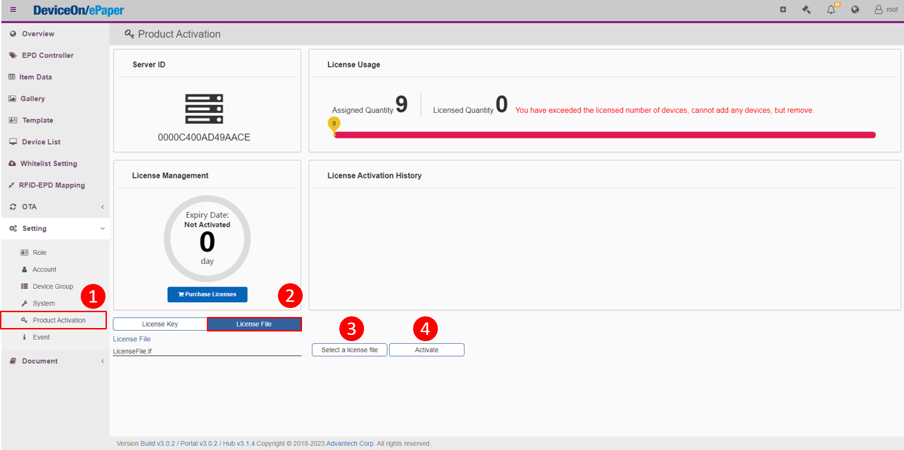
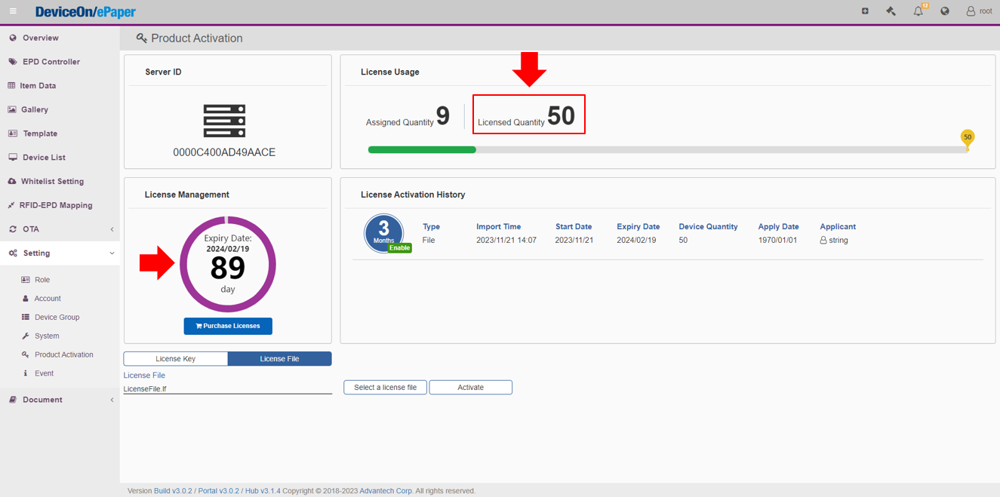

# Product Activation

Activate DeviceOn/ePaper Product

## Sign in DeviceOn/ePaper and apply for a license

> Sign in DeviceOn/ePaper with the account credentials you set up previously.

<figure><figcaption></figcaption></figure>

> Upon your first login, a notice will open asking you to start a free trial or obtain a paid license through product activation. Activating a license is a prerequisite to handling EPD devices in the system.

<figure><figcaption></figcaption></figure>

> There are two license activation options: apply for a free trial (90-Day) via the **Request Form (method 1) or** directly purchase using the **SAP flow from Advantech (method 2)** . Both require the **License Request Code**, which contains device information details like the **MAC address**. Please copy or download this code to use for either activation method.

<figure><figcaption></figcaption></figure>

### Method 1:  Trial Usage

> Use the [request form](https://wesstorage.blob.core.windows.net/cloudservice/deviceon/license.html) to input your personal information. Be sure to correctly fill out both your <mark style="color:blue;">**email**</mark> and the copied <mark style="color:blue;">**License Request Code**</mark>. Once you've verified the details are all accurate, submit the form. The trial license will be sent to the email you provide as soon as it is prepared.

<figure><figcaption></figcaption></figure>

> When the audit process is done, expect an email from us containing the attached license file.

<figure><figcaption></figcaption></figure>

### Method 2: Order from Advantech SAP system

Please contact the Advantech sales team for assistance with activation and setup.

## Import License File

> Locate the license attached in the email and activate it with the "**Activate**" button.

<figure><figcaption></figcaption></figure>

> Then you will see that the number of Licensed Quantity changed and how long you can use this product.&#x20;

<figure><figcaption></figcaption></figure>
