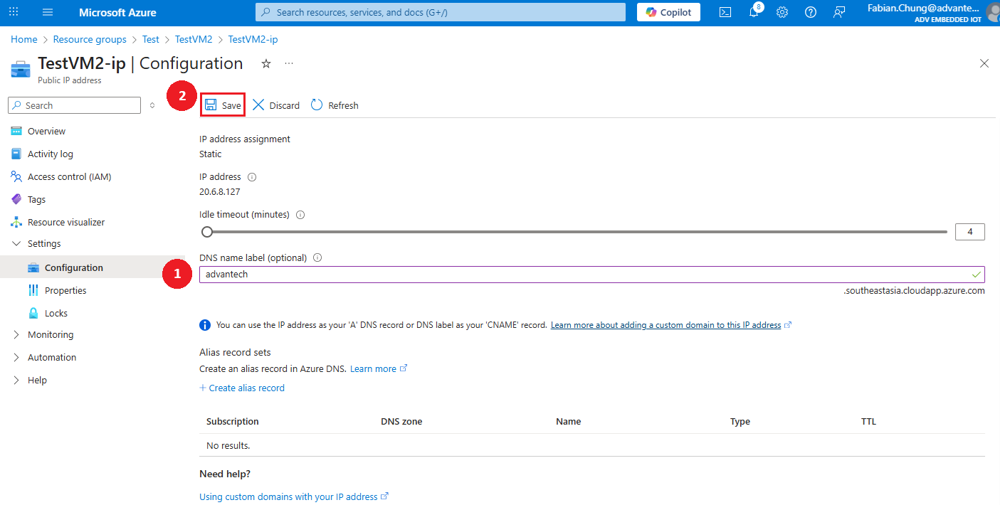

# Secure Connection via HTTPS


In this recipe, we will generate a **Let's Encrypt** certificate using **Certbot**. This certificate will then be deployed for use in the DeviceOn/ePaper server.

* [Let’s Encrypt](https://letsencrypt.org/) is a free, automated, and open-source Certificate Authority.
* [Certbot](https://certbot.eff.org/) is a console-based certificate generation tool for Let's Encrypt.

**Please Note:** For production environments, it is strongly recommended to obtain an SSL/TLS certificate from a trusted and reputable Certificate Authority (CA) based on your organization's security and compliance requirements. Each CA provides its procedures for certificate issuance, validation, and renewal, which should be followed accordingly.

In this guide, we use **Let’s Encrypt**, a free and automated open-source CA, as an example to illustrate the certificate generation and deployment process. While Let’s Encrypt is suitable for development or internal use, organizations requiring extended validation, wildcard domains, or long-term support should consider using a commercial CA.


**Requirements:**

1. Port 443 for https needs to be open and available at time of executing certbot.
2. Certbot needs root access while executing because only root is allowed to bind to any port below 1024.
3. An https certificate must be bound to a valid domain name. Please choose an appropriate top-level domain (TLD) and register it through a domain registrar of your choice.

<details>

<summary>Using an Azure VM? Follow these steps to register a domain name</summary>

1. Go to the [Azure Portal](https://portal.azure.com).

2) Navigate to **Virtual Machines** and select your VM.

3. In the **Overview** tab, find:

* **Public IP address**: Click it to open the Public IP resource.
* In the **Public IP address** blade, you’ll see a field named **DNS name** or **DNS name label**.

- If it’s empty, click **Configuration** in the left menu of the Public IP, and set a **DNS name label** (e.g., <mark style="color:orange;">advantech</mark>).

4. Save changes.\
   You will now have a DNS name like:

```
advantech.southeastasia.cloudapp.azure.com
```

</details>

#### Step 1. Access the [Certbot](https://certbot.eff.org/instructions?ws=other\&os=snap) website and select options as below.

> My HTTP website is running <mark style="color:red;">Other</mark> on <mark style="color:red;">Linux (snap)</mark>.

<figure><figcaption></figcaption></figure>

#### Step 2. SSH into the server and install snapd with sudo privileges

```
sudo apt update
sudo apt install snapd
```

Either log out and back in again, or restart your system, to ensure snap’s paths are updated correctly.

#### Step 3. Remove certbot-auto and any Certbot OS packages (Optional)

If you have any Certbot packages installed using an OS package manager like `apt`, `dnf`, or `yum`, you should remove them before installing the Certbot snap to ensure that when you run the command `certbot` the snap is used rather than the installation from your OS package manager. The exact command to do this depends on your OS, but common examples are `sudo apt-get remove certbot`, `sudo dnf remove certbot`, or `sudo yum remove certbot`.

#### Step 4. Install Certbot

```
sudo snap install --classic certbot
```

#### Step 5. Creates a symbolic link and allows users to run `certbot` directly

```
sudo ln -s /snap/bin/certbot /usr/bin/certbot 
```

#### Step 6. Run the following command and follow the instructions to setup certbot

```
sudo certbot certonly --webroot
```

> Enter the domain name(s) you would like on your certificate

<div align="left"><figure><figcaption></figcaption></figure></div>
