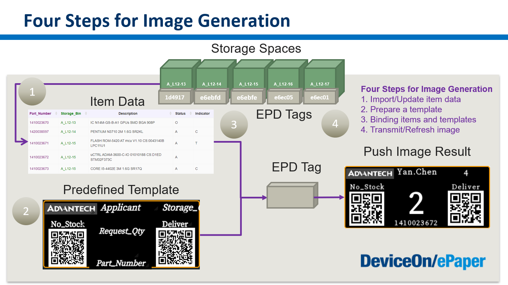

# General Function


In smart warehouse applications, ePaper displays mounted on shelves are used to show the status of incoming and outgoing item numbers, quantities during picking, and information about stock shortages. Integrating such a platform not only allows for real-time synchronization of information with the customer's backend systems but also offers ESG (Environmental, Social, and Governance) benefits and time-saving advantages. This integration promotes environmental sustainability and operational efficiency by reducing paper usage and streamlining inventory management processes.


Using the smart warehouse application as an example, we can display the information of warehouse item numbers on individual ePaper displays through the following four steps:

1. **Data Collection**: Gather the item number information from the warehouse management system.
2. **Template Design:** Design a template with a user-friendly template designer.&#x20;
3. **Data Assignment**: Assign the transmitted data to specific EPD displays corresponding to the designated items.
4. **EPD Display Update**: Update the EPD displays with the assigned item number information, ensuring each display shows the correct data for its respective item.

<figure><figcaption></figcaption></figure>

## **Data Collection**

Step 1. Prepare and import your item (storage) data

> Open an Excel, generate the item (storage) data you want to show on the EPD device, and save as a CSV file.

<figure><figcaption></figcaption></figure>

Step 2. Navigate to the **Item Data** page on DeviceOn/ePaper, and create a data source named as Storage.

<figure><figcaption></figcaption></figure>

<figure><figcaption></figcaption></figure>

Step 3. Click the **Select File** button and import the item (storage) data you just prepared.

<figure><figcaption></figcaption></figure>

Step 4. Upload successfully.

<figure><figcaption></figcaption></figure>

<figure><figcaption></figcaption></figure>

## **Template Design**

### Create a new template

Step 1. Navigate to **Template** page, and click the **Create a new one** option.

<figure><figcaption></figcaption></figure>

Step 2. Decide a template name.

<figure><figcaption></figcaption></figure>

Step 3. Based on EPD devices, you should choose the correct EPD model.

<figure><figcaption></figcaption></figure>

Step 4. Use the data source you just created. In this case, we use Storage as our data source.

<figure><figcaption></figcaption></figure>

In the Canvas setting, you can decide the following:

* **EPD Model:** as EPD-230 (2.9” BW) according to which EPD device you have.
* **Data Source** as Storage, which is the item (storage) data you just upload in the **Data Collection** section.
* **Template Name** as Storage\_t1.
* **Direction** as Landscape or Portrait and **Display Orientation** as Reverse or Forward, which you can check schematic view below.
* **Background color** for the canvas.

<figure><figcaption></figcaption></figure>

After setting these, please save it by clicking the **save** icon.

<figure><figcaption></figcaption></figure>

### Static Label Component

Step 1. You can set up a **Label** by dragging the first icon to a specific position.

<figure><figcaption></figcaption></figure>

Step 2. In the Property setting, you can decide the following:

* **Position** and **Size**
* **Value**, which is the static text you want to show permanently
* **Font family**, **Font size**, **Alignment**, **Font color**, and so on.

<figure><figcaption></figcaption></figure>

<figure><figcaption></figcaption></figure>

Step 3. After setting these, please save it by clicking the **save** icon.

### Image Component

Step 1. You can set up an Image by dragging the **Image** icon to a specific position.

<figure><figcaption></figcaption></figure>

Step 2. In the Property setting, you can decide the following:

* **Position** and **Size**
* **Value**, which have two kinds of situations.
  * When you choose == User Defined ==,  you can upload a **Static Image** as **Logo**.
  * When you choose others, you assign the column of your item data as an **image file name** (**Dynamic Image**).
* **Brightness Enhancement**
* **Dithering Enhancement**

<figure><figcaption></figcaption></figure>

<figure><figcaption></figcaption></figure>

Step 3. After setting these, please save it by clicking the **save** icon.

#### Shape Component

Step 1. You can set up a Shape by drag the **Shape** icon to a specific position.

<figure><figcaption></figcaption></figure>

Step 2. In the Property setting, you can decide the following:

* **Position** and **Size**
* **Value**, which you can choose Rectangle, Triangle, and Circle
* **Line Width**
* **Line Color**
* **Fill Color**
* **Background Color**

<figure><figcaption></figcaption></figure>

<figure><figcaption></figcaption></figure>

Step 3. After setting these, please save it by clicking the **save** icon.

### Dynamic Text Component

Step 1. You can set up a **Text** by dragging the Text icon to a specific position.

<figure><figcaption></figcaption></figure>

Step 2. In the Property setting, you can decide the following:

* **Position** and **Size**
* **Value**, which you can choose the column of your item (storage) data
* **Font family**, **Font size**, **Alignment**, **Font color**, and so on.

<figure><figcaption></figcaption></figure>

<figure><figcaption></figcaption></figure>

Step 3. After setting these, please save it by clicking the save icon.

### Line Component

Step 1. You can set up a **Line** by dragging the line icon to a specific position.

<figure><figcaption></figcaption></figure>

Step 2. In the Property setting, you can decide the following:

* **Position** and **Size**
* **Direction**,  which is Horizontal or Vertical
* **Line color**
* **Line Width**

<figure><figcaption></figcaption></figure>

<figure><figcaption></figcaption></figure>

Step 3. After setting these, please save it by clicking the save icon.

### QR Code Component

Step 1. You can set up a **QR Code** by dragging the QR Code icon to a specific position.

<figure><figcaption></figcaption></figure>

Step 2. In the Property setting, you can decide the following:

* **Position** and **Size**
*   **Value**, which have two situations.

    * When you choose == User Defined ==,  you can assign it as **Static Content** by filling in the data in the **Sample** field.
    * When you choose others, you assign the column of your item data as **Dynamic Content**. This will change value according to bound data.

    <figure><figcaption></figcaption></figure>

    <figure><figcaption></figcaption></figure>

    Step 3. After setting these, please save it by clicking the save icon.

### Barcode Component

Step 1. You can set up a **Barcode** by dragging the Barcode icon to a specific position.

<figure><figcaption></figcaption></figure>

Step 2. In the Property setting, you can decide the following:

* **Position** and **Size**
*   **Value**, which have two situations.

    * When you choose == User Defined ==,  you can assign it as **Static Content** by filling in the data in the **Sample** field.
    * When you choose others, you assign the column of your item data as **Dynamic Content**. This will change value according to bound data.

    <figure><figcaption></figcaption></figure>

    <figure><figcaption></figcaption></figure>

Step 3. After setting these, please save it by clicking the save icon.

### Preview & Export

Step 1. You can click the **preview** icon to give you the first view of your template. You can modify and save it if necessary.

<figure><figcaption></figcaption></figure>

<figure><figcaption></figcaption></figure>

Step 2. You also can export as a JSON file as a backup copy in case next time you want to use it on another DeviceOn/ePaper server.

<figure><figcaption></figcaption></figure>

<figure><figcaption></figcaption></figure>

<figure><figcaption></figcaption></figure>

## **Data Assignment**

In this section, you can bind the item data (from **Data Collection**) and the template  (from **Template Design**) to an EPD device

Step 1. Navigate to the **EPD Controller** page, and choose the EPD device you want to bind with. Click the **Bind** action as below.

<figure><figcaption></figcaption></figure>

Step 2. Select a specific item and a specific template.

<figure><figcaption></figcaption></figure>

Step 3. Bind the template and data successfully.

<figure><figcaption></figcaption></figure>

## **EPD Display Update**

In this section, you can trigger the **transmit** command on an EPD device.

Step 1. Navigate to the **EPD Controller** page, and choose the EPD device you want to transmit the image. Please click the **Transmit** icon as below.

<figure><figcaption></figcaption></figure>

Step 2. You can decide the following transmit parameters:

* Which page&#x20;
* Refresh immediately after transmit&#x20;
* Blink LED lights or not after transmit

<figure><figcaption></figcaption></figure>

Step 3. Send command successfully. After few minutes, you will see EPD device displays the content.

<figure><figcaption></figcaption></figure>
