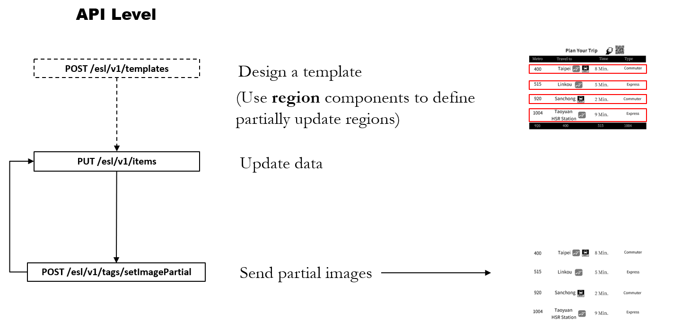

# Partial Image Update


**Application Scenario**

A central server is responsible for updating bus information on nearly one hundred e-paper displays at bus stops. These updates are communicated wirelessly using 4G/5G LTE technology and must occur within one minute.


Here we present two functions that can fulfill the application scenario mentioned above

1. Partial Update
2. Deploy Template

## Partial Update

### Technical Concept

The DeviceOn/ePaper server generates a full image, performs cutting based on **region** components, and transmits partial images to the device.

> **Limitation:** DeviceOn/ePaper can support parallel processing for updating data on up to 30 devices within 20 seconds.

#### Advantages

1. Consistent layout, no issues with font inconsistency or alignment
2. All components are adaptable, such as changing icons or displaying Chinese characters.
3. No secondary development is required on the device side.

#### Disadvantages

1. Server takes about one second to transmit each segmented image to the device

### API Overview

<figure><figcaption></figcaption></figure>

### Steps

Step 1. Create a data source named BusTest, and then upload data on the **Item** page.

<figure><figcaption></figcaption></figure>

Step 2. Navigate to the **Template** page, and based on the application scenario, create templates using available components.

<figure><figcaption></figcaption></figure>

Step 3. Use the **Region** component to frame the area for Partial Update.

<figure><figcaption></figcaption></figure>

Step 4. The name of each **Region** can be changed, but it must not be duplicated.

<figure><figcaption></figcaption></figure>

Step 5. Navigate to **EPD Controller** page. First bind the **Template and Data**, then click **Transmit**.

<figure><figcaption></figcaption></figure>

Step 6. Click **Partial Update**, and add the newly named **Regions**, and then click **OK.**

<figure><figcaption></figcaption></figure>

˙Step 7. You can also send transmit commands through the API: **Partial Image Update (Async)**.

<figure><figcaption></figcaption></figure>

## Deploy Template

### Technical Concept

The DeviceOn/ePaper server sends a template to the devices, allowing the e-paper displays to render images locally based on individual components.

> **Limitation:** DeviceOn/ePaper can support parallel processing for updating data on up to 160 devices within 20 seconds.

#### Advantages

1. **Fast Transmission Rate**: Only text commands are transmitted, which are smaller in size and thus quicker to send.
2. **Local Time Display**: Devices can display the current time, updated every minute.
3. **Local Advertisement Rotation**: Devices can locally rotate advertisements every 30 seconds.

#### Disadvantages

1. **Limited to Alphanumeric Display**: The e-paper can only display English letters and numbers.
2. **Fixed Fonts**: Fonts are fixed, potentially causing inconsistencies with other parts of the display.
3. **Individual Component Updates**: Each component is updated individually, allowing only 10 devices to be updated per minute.

### API Overview

<figure><figcaption></figcaption></figure>

### Template Specification

<figure><figcaption></figcaption></figure>

### Steps

Step 1. Create a data source named AdvBusDemo, and then upload data on the **Item** page.

<figure><figcaption></figcaption></figure>

Step 2. Navigate to the **Template** page, and based on the application scenario, create templates using data, time, and carousel components.

<figure><figcaption></figcaption></figure>

Step 3. Navigate to the **Gallery** page, select the AdvBusDemo data source, and proceed to upload advertisement and bus animation images.

<figure><figcaption></figcaption></figure>

Step 4. Bind the template and data to the device that supports the "Deploy Template" function. Remember to click "**Deploy Template**" to **ON** in the binding window.

<figure><figcaption></figcaption></figure>

<figure><figcaption></figcaption></figure>

Step 5. Click on **Data** button to execute the Send Data command.

<figure><figcaption></figcaption></figure>

Step 6. Add and configure the data for partial updates.

<figure><figcaption></figcaption></figure>

˙Step 7. You can also send transmit commands through the API: **Update Batch Data (Async)**.

<figure><figcaption></figcaption></figure>
