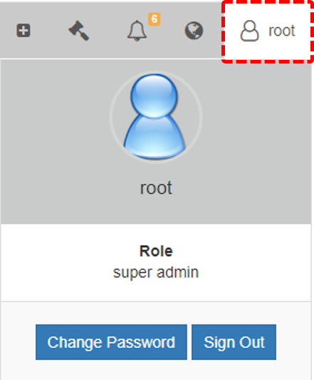

# 🏠 Web User Interface

The DeviceOn/ePaper web interface is based on the VUE framework. The user interface is divided into three main parts: the navigation bar at the top, the menu bar at the left and the main content in the center with.

<figure><figcaption></figcaption></figure>

## Navigation Bar 

### Account Information

Click the account icon to show the currently logged in account and respective role. Click “**Sign Out**” to log out from DeviceOn/ePaper and remove personal information like cookies or tokens.

<figure><figcaption></figcaption></figure>

### **Languages**

DeviceOn/ePaper supports multiple languages that can be changed by clicking the globe icon in the navigation bar. Currently there are three languages to choose from: **English**, **Traditional Chinese** and **Simplified Chinese**.

<figure><figcaption></figcaption></figure>

### Notification

If there are any active notifications, the number of event log messages is shown on the notification icon. Three levels of events are supported: “**Information**”, “**Warning**” and “**Error**”. Click “**View all event**” to open the event log page.

<figure><figcaption></figcaption></figure>

### **Device Onboarding**

To onboard devices, click the onboarding icon to setup the WISE router and to look up the required connection credentials.

<figure><figcaption></figcaption></figure>

<figure><figcaption></figcaption></figure>
