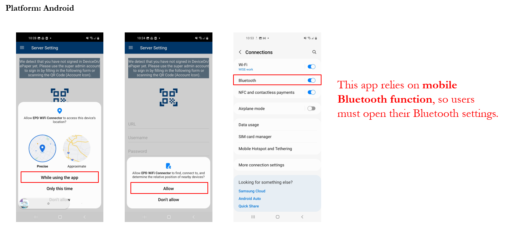

# WiFi-based

<figure><figcaption></figcaption></figure>

## Search and install the APP

> EPD WiFi Connector is a utility app produced by Advantech, which can be used to assist Advantech's electronic paper devices (EPD models: EPD-562, EPD-662, EPD-660, EPD-765, EPD-763, EPD-258) to connect DeviceOn/ePaper server through Bluetooth. Users can connect EPD devices to DeviceOn/ePaper through their own WiFi access point. In addition, this utility app has the function of scanning nearby devices, connecting multiple devices, and blinking LED lights at the same time. Plus, this utility can keep records of connection, which is convenient for users to carry out the next deployment.

1. Please go to the **Google Play** or **App Store** to download this App. The app name is **EPD WiFi Connector**, please search it on either platform and just access it directly by scanning the following link.

<figure><figcaption></figcaption></figure>

2. Open the **EPD WiFi Connector**. When users launch this app for the first time, they need to allow several permissions for Bluetooth communication.

<figure><figcaption></figcaption></figure>

<figure><figcaption></figcaption></figure>

## Sign In DeviceOn/ePaper

1. Open a browser and sign in the DeviceOn/ePaper. Then, click the **account** icon to display a QRCode to aid **EPD WiFi Connector** to fast sign in.

<figure><figcaption></figcaption></figure>

2. Go to the **Server Setting** in the app, and scan it!

<figure><figcaption></figcaption></figure>

<figure><figcaption></figcaption></figure>

## Assign necessary information to e-paper devices through Bluetooth

1. Go to the **Device Onboarding** in the app, and then wait a few minutes to scan the nearby devices. Then, select the devices that you want to connect to DeviceOn/ePaper, and then fill in the necessary information below. After that, please key in the **passkey** for accessing devices.

**SSID:** WiFi SSID

**Password:** WiFi Password

**Server IP:** DeviceOn/ePaper IP

**Server Port:** 1883

<figure><figcaption></figcaption></figure>

<figure><figcaption></figcaption></figure>

<figure><figcaption></figcaption></figure>

<figure><figcaption></figcaption></figure>

2. After few minutes, you should see the online message for the EPD-Device on DeviceOn/ePaper.
