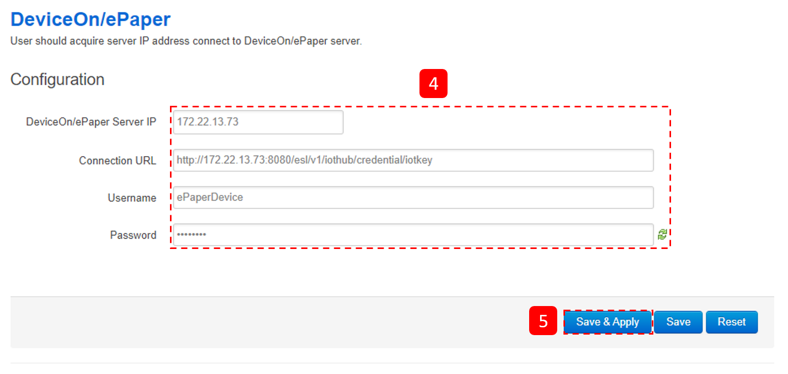
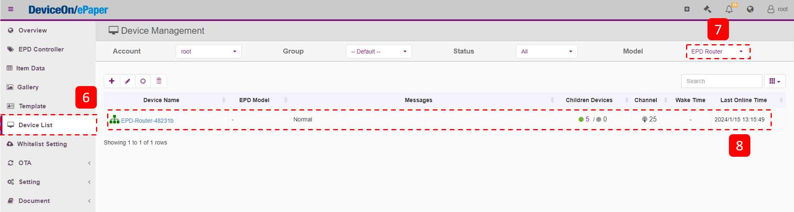
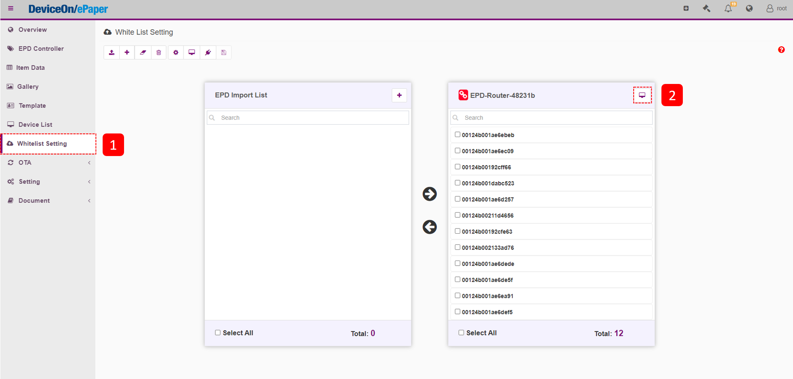

# zigbee-based EPD devices

<figure><figcaption></figcaption></figure>

## Configures Server IP on WISE-3240 platforms

Step 1. Open a browser and input **http://{YOUR\_WISE\_3240\_IP}**, you should see the WISE-3240 login page.

> Sign in to WISE-3240 management portal with the default account credentials.

<figure><figcaption></figcaption></figure>

Step 2. Go to the **Device Onboarding** page under the **DeviceOn/ePaper** item.&#x20;

<figure><figcaption></figcaption></figure>

Step 3. Copy the on-boarding information from DeviceOn/ePaper server and then paste them to the following inputs.

<figure><figcaption></figcaption></figure>

<figure><figcaption></figcaption></figure>

Step 4. After a few minutes, you should see the online message for the EPD-Router device on DeviceOn/ePaper.

<figure><figcaption></figcaption></figure>

## Assign EPD’s MAC addresses to the whitelist on each WISE-3240 router.

Step 1. Open a browser and sign in the DeviceOn/ePaper. Then, go to the **Whitelist Setting** page to configure the whitelist of WISE-3240 routers.

<figure><figcaption></figcaption></figure>

Step 2. Select one WISE-3240 router.

<figure><figcaption></figcaption></figure>

Step 3. Click the **Add** button to add one MAC address.

<figure><figcaption></figcaption></figure>

Step 4. Key in the MAC address of an e-paper device, and then click **OK**.

<figure><figcaption></figcaption></figure>

Step 5. Click this MAC address and then click the **left arrow** to move this MAC address to this WISE-3240 router.

<figure><figcaption></figcaption></figure>

Step 6. Click the **save** button to save this setting.

<figure><figcaption></figcaption></figure>

<figure><figcaption></figcaption></figure>

Step 7. After few minutes, you should see the online message for the EPD devices on DeviceOn/ePaper.

<figure><figcaption></figcaption></figure>
