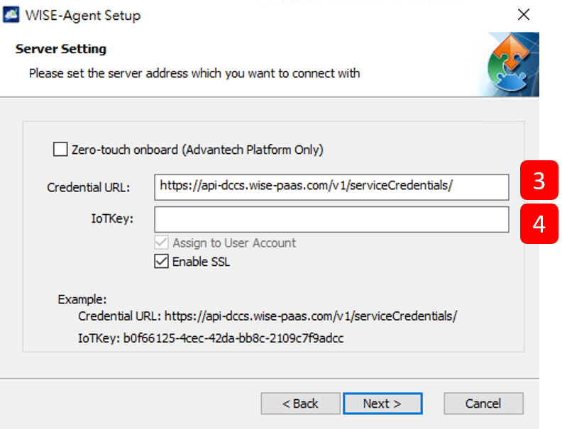

# Other Devices


Advantech provides a device client that is used to communicate and exchange information between IoT (Internet of Things) devices and the DeviceOn/ePaper cloud services, called **DeviceOn Agent**. **DeviceOn Agent** provides a rich set of user-friendly features that are intelligent, standardized, and scalable.


1. Download **DeviceOn Agent** from the following link:&#x20;



> Available for Windows 7 SP1/8/10 (32-bit/64-bit) and Ubuntu 18.04/18.04(jetson)/20.04/22.04 (x64).

2. Install it, and then fill in the following information.

<figure><figcaption></figcaption></figure>

<figure><figcaption></figcaption></figure>

3. Go to the installation path of DeviceOn Agent and find the agent\_config.xml file. Open the **agent\_config.xml** file, and then change the **SWProduct** name to **ESL.**

<figure><figcaption></figcaption></figure>

3. After a few minutes, you should see the online message for this device on DeviceOn/ePaper.

